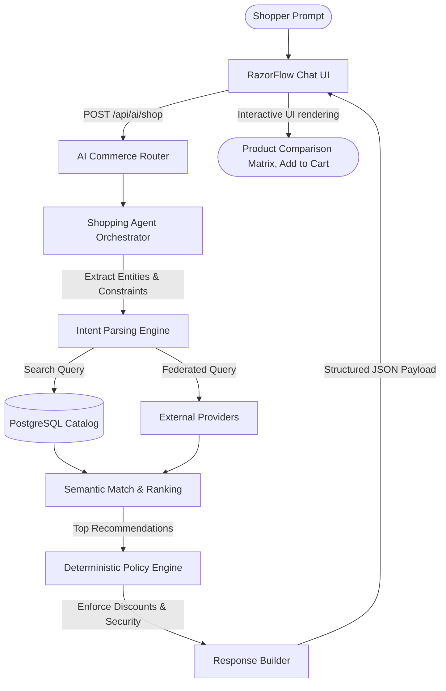

# ⚡ RazorFlow AI Commerce

> **Razorpay AI Buildathon — Track 01: AI Growth & Agentic Commerce**  
> *"Grow the merchant's revenue, and make them sellable to AI buyers."*

---

## 🚀 Key Highlights & Architectural Foundations

1. **MCP / AI Interoperability & Canonical Tool Registry (Phase 9)**: Standard Model Context Protocol (MCP) JSON-RPC 2.0 adapter and 12 canonical agent tools (`get_capabilities`, `get_catalog`, `search_products`, `get_product`, `create_cart`, `get_cart`, `add_to_cart`, `update_cart_item`, `remove_from_cart`, `create_purchase_intent`, `checkout`, `get_order`) with strict schema validation, risk tiers, and zero secret leakage.
2. **Deterministic Merchant AI-Readiness Control Plane**: Deterministically scores merchant commerce readiness (0–100) across 15 verifiable PostgreSQL database state dimensions (`TRANSACTION_READY`).
3. **End-to-End Agent Transaction Tracing**: Root `correlationId` tracking propagating through MCP ➔ Tool Registry ➔ Gateway ➔ Cart ➔ Policy Engine ➔ Order ➔ Razorpay ➔ 5W1H Audit.
4. **AI Buyer / Agentic Commerce Gateway (`/api/agent/v1/*`)**: Standardized M2M protocol (`razorflow-agent-commerce/1.0`) with capability discovery, machine-readable catalogs, structured search with fact/ranking separation, scoped RBAC tokens, and autonomous checkout.
5. **Deterministic Policy Engine (`server/policyEngine.ts`)**: Strict separation where AI models and external buyers may only propose actions while deterministic code enforces merchant discount caps (15%), single-order bounds, and approval gates.
6. **Zero-Trust Price Recalculation**: Prices, taxes, discounts, and inventory availability are recomputed server-side from PostgreSQL on every lifecycle mutation. Client amounts are never trusted.
7. **Real Razorpay Test Mode Payment Lifecycle**: Full HMAC-SHA256 signature verification, idempotent webhooks, and strict order binding.
8. **AI Growth Engine & Revenue Intelligence**: Direct Supabase SQL metric calculation (GMV, AOV, orders), abandoned cart recovery, statistical upsell pairing, and automated bundle discovery.

### 🧠 AI Orchestration Flow



---

## 🟢 Verified Status Baseline (Phases 1–11)

```text
Phase 1   🟢 Real Commerce Backend & Deterministic Policy Engine     (9/9 Passed)
Phase 2   🟢 Multi-Provider External Product Discovery               (8/8 Passed)
Phase 3   🟢 Persistent Supabase Commerce State & Repositories       (7/7 Passed)
Phase 4   🟢 Real AI Shopping Agent & Freshness Engine               (8/8 Passed)
Phase 4.5 🟢 Live AI Shopping Agent HTTP Verification                (Verified)
Phase 5   🟢 Cart, Order & Inventory Lifecycle                       (8/8 Passed)
Phase 6   🟢 Real Razorpay Payment Execution & Lifecycle             (20/20 Passed)
Phase 7   🟢 AI Merchant Growth Engine & Revenue Optimization        (20/20 Passed)
Phase 7.5 🟢 Live AI Growth Engine HTTP Verification                 (Verified)
Phase 8   🟢 AI Buyer / Agentic Commerce Gateway                     (48/48 Passed)
Phase 9   🟢 MCP / AI Interoperability & AI-Readiness Control Plane   (54/54 Passed)
Phase 10  🟢 Merchant AI Control Center & Governance Cockpit         (50/50 Passed)
Phase 11  🟢 Autonomous AI Revenue Operations & Bounded Execution    (54/54 Passed)
─────────────────────────────────────────────────────────────────────────────
Master Test Suite: 286 / 286 TESTS PASSED (100% GREEN)
Phase 11 Live Verification Gates: 22 / 22 GATES PASSED (100% GREEN)
Phase 10 Live Control Center Gates: 17 / 17 GATES PASSED (100% GREEN)
Phase 9 Live MCP Verification Gates: 17 / 17 GATES PASSED (100% GREEN)
Lint: 0 errors | TypeScript: 0 errors | Production Build: SUCCESS
```

---

## 🛠️ Quick Start

### 1. Install Dependencies
```bash
npm install
```

### 2. Configure Environment Variables
Copy `.env.example` to `.env`:
```bash
cp .env.example .env
```

### 3. Run Master Verification Test Suite (286 Tests across Phases 1–11)
```bash
npm test
```

### 4. Run Live Phase 11 Autonomous Revenue Operations Verification (22 Gates)
```bash
npx tsx server/commerce/verify_autonomous_growth_live.ts
```

### 4. Run Live Phase 10 Merchant AI Control Center Verification (17 Gates)
```bash
npx tsx server/commerce/verify_merchant_ai_control_center_live.ts
```

### 5. Run Live Phase 9 MCP & AI-Readiness Verification (17 Gates)
```bash
npx tsx server/commerce/verify_mcp_agent_live.ts
```

### 6. Run Live Phase 8 Agent Gateway Verification (10 Gates)
```bash
npx tsx server/commerce/verify_agent_commerce_live.ts
```

### 7. Start Development Server
```bash
npm run dev
```

---

## 📖 Comprehensive Documentation
- [Merchant AI Control Center (Phase 10)](file:///Users/krish/Razorpay/docs/merchant-ai-control-center.md)
- [MCP & Agent Commerce Specification](file:///Users/krish/Razorpay/docs/mcp-agent-commerce.md)
- [Deterministic AI Readiness Engine](file:///Users/krish/Razorpay/docs/ai-readiness.md)
- [Agent Transaction Tracing Engine](file:///Users/krish/Razorpay/docs/agent-tracing.md)
- [Agentic Commerce Protocol (Phase 8)](file:///Users/krish/Razorpay/docs/agent-commerce.md)
- [Architecture & Domain Models](file:///Users/krish/Razorpay/docs/architecture.md)
