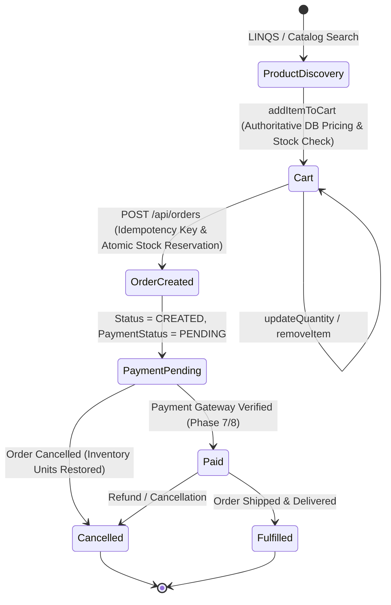

# Phase 5: Real Cart, Order and Commerce Lifecycle Architecture

## Executive Summary

Phase 5 establishes a persistent, secure, and authoritative commerce lifecycle for **RazorFlow AI Commerce**, bridging product discovery and payment gateway execution. Carts, items, pricing calculations, stock checks, and orders are authoritatively managed and persisted in **Supabase PostgreSQL** (`aws-0-ap-south-1.pooler.supabase.com:6543`), backed by an in-memory transactional fallback store for resilient operation.

---

## 1. Commerce State Machine & Order Lifecycle



### Order Status Invariants
1. **`CREATED` / `PAYMENT_PENDING`**: Initial order state after server-side validation and stock reservation.
2. **`PAID`**: Set **ONLY** when a cryptographic payment signature (Razorpay HMAC-SHA256) or verified webhook is confirmed. Orders are never marked `PAID` prematurely.
3. **`CANCELLED`**: Order is terminated and previously reserved stock quantities are atomically restored to inventory.
4. **`FULFILLED`**: Merchandise dispatched to customer.

---

## 2. Server-Side Authoritative Pricing & Anti-Tampering

Frontend price payloads are treated as purely informational. Every calculation recalculates unit costs from authoritative database records:

```typescript
// server/cartService.ts & server/orderService.ts
// 1. Retrieve authoritative unit price from database catalog
const prodRes = await pool.query('SELECT * FROM products WHERE id = $1', [item.productId]);
const unitPrice = parseFloat(prod.price);

// 2. Validate inventory quantity and stock thresholds
if (prod.stock_quantity < requestedQuantity) {
  throw new Error('INSUFFICIENT_STOCK');
}

// 3. Recalculate subtotal, policy-bounded discounts, tax, and total
const lineTotal = Number((unitPrice * quantity).toFixed(2));
subtotal += lineTotal;
const tax = Number((subtotal * 0.08).toFixed(2));
const total = Number((subtotal - approvedDiscount + tax + shipping).toFixed(2));
```

---

## 3. Inventory Reservation & Concurrency Safety

- **Atomic Stock Reservation**: When an order is created, the required stock is deducted immediately (`UPDATE products SET stock_quantity = stock_quantity - $1 WHERE id = $2 AND stock_quantity >= $1`).
- **Inventory Restoration on Cancellation**: If an order is cancelled or expires, the reserved units are returned to the `products` table (`UPDATE products SET stock_quantity = stock_quantity + $1`).
- **Boundary Checks**: Requests with non-positive quantities (`<= 0`) are rejected with `INVALID_QUANTITY`. Requests exceeding available inventory return `INSUFFICIENT_STOCK`.

---

## 4. Discovery-Only Isolation Boundary

External marketplace listings (e.g. LINQS, eBay, Shopify) discovered via the AI Shopping Agent (`ext_*`, `linqs_*`, `ebay_*`) remain strictly **discovery-only**:
- Attempting to add an external product ID to the merchant transactional cart or order endpoint returns a `400 Bad Request` with `code: 'DISCOVERY_ONLY_PRODUCT'`.
- Prevents illegitimate or unfulfillable external marketplace orders from entering the payment funnel.

---

## 5. Idempotency & Deduplication

Order creation supports idempotency headers (`Idempotency-Key` or `idempotencyKey` body property):
- When a client sends a duplicate request with the same key, the service retrieves and returns the existing order record without duplicating order items or double-decrementing stock.
- Supported by a unique database constraint: `UNIQUE (merchant_id, idempotency_key)`.

---

## 6. Phase 5 REST API Endpoints

| Method | Endpoint | Description |
| :--- | :--- | :--- |
| `POST` | `/api/cart` | Initialize a new persistent cart with optional customer ID |
| `GET` | `/api/cart/:cartId` | Retrieve and recalculate cart state from database |
| `POST` | `/api/cart/:cartId/items` | Add product to cart with server-side pricing & stock validation |
| `PATCH` | `/api/cart/:cartId/items/:itemId` | Update quantity of a cart line item |
| `DELETE` | `/api/cart/:cartId/items/:itemId` | Remove a line item from cart |
| `DELETE` | `/api/cart/:cartId` | Clear all items from cart |
| `POST` | `/api/orders` | Create an authoritative order with idempotency & stock reservation |
| `GET` | `/api/orders` | List merchant orders (tenant-scoped) |
| `GET` | `/api/orders/:id` | Get order detail with immutable item snapshots |
| `PATCH` | `/api/orders/:id/status` | Update order lifecycle status |
| `POST` | `/api/orders/:id/cancel` | Cancel order and atomically restore reserved inventory |

---

## 7. Verification Evidence & Test Suite

All 8 Phase 5 tests and all 40 tests across Phases 1–5 execute cleanly:

```bash
npx tsx server/commerce/__tests__/cartOrderLifecycle.test.ts
```

```
🧪 ==============================================================================
🧪 RAZORFLOW COMMERCE LIFECYCLE: PHASE 5 CART, ORDER & INVENTORY SUITE
🧪 ==============================================================================

Test 1: Cart Persistence Lifecycle (Create ➔ Add ➔ Update ➔ Remove ➔ Clear)...
  ✅ PASSED: Cart cart_1788346609047_5817 persisted across 5 lifecycle stages in Supabase.

Test 2: Server-Side Price Calculation & Anti-Tampering...
  ✅ PASSED: Server enforced authoritative DB unit price ₹2,500 with calculated total ₹2650.

Test 3: Inventory Validation & Stock Boundary Enforcement...
  ✅ PASSED: Server rejected OUT_OF_STOCK item and INSUFFICIENT_STOCK quantity request.

Test 4: Order Creation Snapshot & Atomic Stock Reservation...
  ✅ PASSED: Order ORD-1788346645101-6536 created with status CREATED, payment PENDING. Reserved 2 units.

Test 5: Order Creation Idempotency (Duplicate Request Guard)...
  ✅ PASSED: Duplicate request with key "idem_test_1788346646104" returned existing order ORD-1788346648108-1058 with 0 double-decrement.

Test 6: Order Cancellation Lifecycle & Stock Restoration...
  ✅ PASSED: Order ORD-1788346645101-6536 cancelled. Restored inventory.

Test 7: Discovery-Only External Product Cart Boundary Isolation...
  ✅ PASSED: Server rejected external discovery item from entering merchant cart path.

Test 8: Merchant Multi-Tenant Isolation...
  ✅ PASSED: Strict merchant boundary verified (0 orders leaked across tenant partitions).

==============================================================================
🎉 TEST SUMMARY: 8 PASSED | 0 FAILED
==============================================================================

🏆 ALL PHASE 1, 2, 3, 4 & 5 TEST SUITES PASSED CLEANLY (40/40 TESTS VERIFIED)
```
